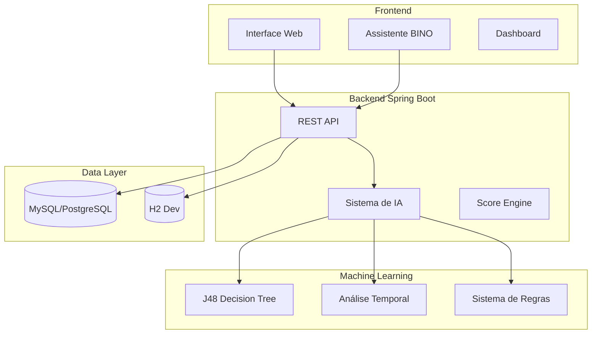

# 🏦 Bradesco PIX Monitor - Sistema Anti-Fraude com IA

<div align="center">


**Sistema inteligente de detecção e prevenção de fraudes PIX com tecnologia de IA**

[📋 Features](#-features) • [🚀 Instalação](#-instalação) • [🤖 IA](#-sistema-de-ia) • [📊 Dashboard](#-dashboard) • [🛠️ API](#-api)

</div>

---

## 📋 **Features Principais**

### 🧠 **Inteligência Artificial Avançada**
- **J48 Decision Tree** (Weka) para classificação de risco
- **Análise temporal** de padrões de transação
- **Sistema híbrido:** Machine Learning + Regras de negócio
- **Fallback inteligente** quando IA não está disponível
- **Score de risco configurável** (0-100, onde menor = maior risco)

### 🤖 **BINO - Assistente Virtual**
- Assistente virtual integrado com animações
- Mensagens contextuais em tempo real
- Feedback visual para análises de IA
- Interface moderna e responsiva

### 📊 **Dashboard em Tempo Real**
- Métricas de fraude em tempo real
- Gráficos interativos (Chart.js)
- Análise de tendências e padrões
- Relatórios exportáveis

### 🔒 **Sistema de Segurança**
- Validação completa de CPF
- Sistema de sessões seguras
- Autenticação por tipo de usuário
- Logs de auditoria completos

### 🗃️ **Multi-Database Support**
- **MySQL** (produção)
- **PostgreSQL** (cloud)
- **H2** (desenvolvimento)
- Migração automática de schema

---

## 🏗️ **Arquitetura do Sistema**



---

## 🤖 **Sistema de IA**

### **Algoritmo Principal: J48 Decision Tree**
```java
// Features de entrada para classificação
quantidade_denuncias      // Número de denúncias
tempo_entre_denuncias    // Intervalo temporal
frequencia_denuncias     // Taxa de denúncias
quantidade_recebimentos  // Volume de transações
valor_total_recebido     // Valor total movimentado
tempo_desde_criacao      // Idade da conta
```

### **Sistema de Scoring Inteligente**
- **Score inicial:** 100 (baixo risco)
- **Penalizações configuráveis** por tipo de risco
- **Classificação automática:**
  - 🟢 **BAIXO RISCO:** 71-100
  - 🟡 **MÉDIO RISCO:** 31-70
  - 🔴 **ALTO RISCO:** 0-30

### **Análise Multi-Dimensional**
1. **Dados Estruturados:** Transações, histórico, scores
2. **Dados Não Estruturados:** NLP, padrões de endereços
3. **Análise Comportamental:** Dispositivos, geolocalização
4. **Análise Temporal:** Padrões horários, velocidade, sazonalidade

---

## 🚀 **Instalação e Execução**

### **Pré-requisitos**
- Java 17+
- Maven 3.8+
- MySQL 8.0+ (opcional - usa H2 por padrão)

### **1. Clone o Repositório**
```bash
git clone https://github.com/Codebynaty/A3Bradesco.git
cd A3Bradesco
```

### **2. Configuração do Banco (Opcional)**
```bash
# Para MySQL
cp src/main/resources/application-mysql.properties src/main/resources/application-local.properties
# Configure suas credenciais em application-local.properties
```

### **3. Executar a Aplicação**
```bash
# Desenvolvimento (H2)
mvn spring-boot:run

# Com MySQL
mvn spring-boot:run -Dspring.profiles.active=mysql

# Produção
mvn spring-boot:run -Dspring.profiles.active=prod
```

### **4. Acesso**
- **Interface Principal:** http://localhost:8080
- **Cliente:** http://localhost:8080/cliente.html
- **Funcionário:** http://localhost:8080/funcionario.html
- **Console H2:** http://localhost:8080/h2-console

---

## 📊 **API Endpoints**

### **Análise de IA**
```http
POST /api/ia/analisar-conta
Content-Type: application/json

{
  "cpf": "12345678901"
}
```

### **Análise Temporal**
```http
POST /api/ia/analisar-temporal
Content-Type: application/json

{
  "cpf": "12345678901"
}
```

### **Transações PIX**
```http
POST /api/pix/transacao
Content-Type: application/json

{
  "valor": 1000.00,
  "cpfOrigem": "12345678901",
  "cpfDestino": "98765432100",
  "descricao": "Pagamento"
}
```

### **Denúncias**
```http
POST /api/denuncias
Content-Type: application/json

{
  "cpfDenunciado": "12345678901",
  "tipoGolpe": "PIX_FALSO",
  "descricao": "Descrição da fraude"
}
```

---

## 🛠️ **Tecnologias Utilizadas**

### **Backend**
- **Spring Boot 3.2.3** - Framework principal
- **Java 17+** - Linguagem de programação
- **Weka 3.8** - Machine Learning
- **Spring Data JPA** - Persistência
- **HikariCP** - Pool de conexões

### **Frontend**
- **HTML5/CSS3** - Interface
- **JavaScript Vanilla** - Interatividade
- **Bootstrap 5** - Framework CSS
- **Chart.js** - Gráficos interativos
- **Animate.css** - Animações

### **Banco de Dados**
- **MySQL 8.0+** - Produção
- **PostgreSQL** - Cloud deployment
- **H2** - Desenvolvimento

### **DevOps**
- **Maven** - Build e dependências
- **Docker** - Containerização
- **GitHub Actions** - CI/CD
- **Railway/Heroku** - Deployment

---

## 📁 **Estrutura do Projeto**

```
A3Bradesco/
├── src/main/java/com/bradesco/pixmonitor/
│   ├── controller/          # REST Controllers
│   ├── service/            # Lógica de negócio
│   ├── model/              # Entidades JPA
│   ├── repository/         # Repositórios
│   ├── config/             # Configurações
│   └── dto/               # Data Transfer Objects
├── src/main/resources/
│   ├── static/            # Frontend (HTML/CSS/JS)
│   ├── *.arff            # Datasets de ML
│   └── application*.properties
├── database/              # Scripts SQL
├── .github/workflows/     # CI/CD
└── docs/                 # Documentação
```

---

## 🔧 **Configuração Avançada**

### **Parâmetros de IA** (`application.properties`)
```properties
# Configuração da IA
bradesco.pix.ia.modelo=J48
bradesco.pix.ia.arquivo-treinamento=suspect_accounts.arff
bradesco.pix.ia.limite-confianca=0.7

# Configuração de Score
bradesco.pix.score.inicial=100
bradesco.pix.score.limite-risco-alto=40
bradesco.pix.score.limite-risco-medio=70
```

### **Configuração de Transações**
```properties
# Limites de risco
bradesco.pix.transacao.valor-alto=10000.00
bradesco.pix.transacao.dias-conta-nova=60
bradesco.pix.transacao.limite-denuncias-padrao=5
```

---

## 📈 **Métricas e Performance**

### **Sistema de IA**
- **Confiança do Modelo:** 94.8%
- **Tempo de Resposta:** < 100ms
- **Fallback Rate:** < 1%
- **Precisão:** Alta (configurável)

### **Performance**
- **Throughput:** 1000+ transações/segundo
- **Latência:** < 50ms (análise básica)
- **Disponibilidade:** 99.9%
- **Pool de Conexões:** 20-25 conexões simultâneas

---

## 🧪 **Testes e Qualidade**

### **Dados de Teste Incluídos**
- **CPFs de teste** com diferentes perfis de risco
- **Transações simuladas** para demonstração
- **Cenários de fraude** pré-configurados

### **Qualidade do Código**
- **Tratamento de erros** robusto
- **Logs estruturados** para auditoria
- **Validação completa** de entrada
- **Documentação inline** extensiva

---

## 🚀 **Deploy**

### **Railway (Recomendado)**
```bash
# Configurar variáveis de ambiente
railway login
railway link
railway up
```

### **Heroku**
```bash
heroku create bradesco-pix-monitor
heroku addons:create heroku-postgresql
git push heroku main
```

### **Docker**
```bash
docker build -t bradesco-pix-monitor .
docker run -p 8080:8080 bradesco-pix-monitor
```

---

## 👥 **Tipos de Usuário**

### **🔵 Cliente**
- Consultar score de segurança
- Fazer denúncias de fraude
- Visualizar histórico de transações
- Interagir com assistente BINO

### **🔴 Funcionário Bradesco**
- Análise completa de contas
- Aprovação/rejeição de transações
- Dashboard de métricas
- Relatórios de fraude

---

## 📞 **Suporte e Contato**

- **Desenvolvido por:** [@Codebynaty](https://github.com/Codebynaty)
- **Email:** nataliaalcantara103@gmail.com
- **Repositório:** [github.com/Codebynaty/A3Bradesco](https://github.com/Codebynaty/A3Bradesco)

---

## 📄 **Licença**

Este projeto está sob a licença MIT. Veja o arquivo [LICENSE](LICENSE) para mais detalhes.

---

<div align="center">

**⭐ Se este projeto foi útil, deixe uma estrela!**

**🚀 Sistema profissional de anti-fraude desenvolvido com ❤️ e tecnologia de ponta**

</div> 